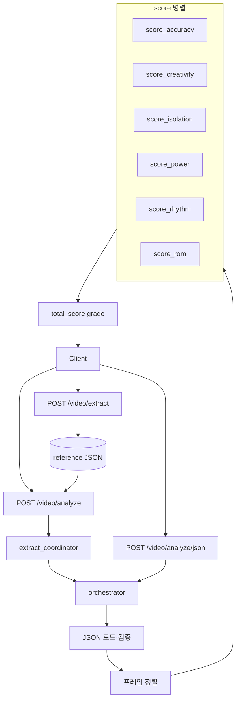
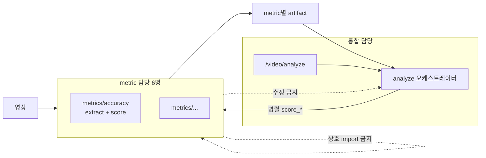

# Metrics 아키텍처

> 최종 갱신: 2026-05-21  
> 구현·API 상세: [ORCHESTRATOR.md](./ORCHESTRATOR.md), [API_REFERENCE.md](./API_REFERENCE.md)

---

## 1. 구성


| 서비스 | 담당 범위 |

|--------|-----------|

| accuracy | `metrics/accuracy/` |

| creativity | `metrics/creativity/` |

| isolation | `metrics/isolation/` |

| power | `metrics/power/` |

| rhythm | `metrics/rhythm/` |

| rom | `metrics/rom/` |


- **6명 · 1인 1서비스** — 자기 `metrics/<이름>/` 만 수정한다.

- **다른 metric 폴더·라우터·analyze 오케스트레이터** 는 수정하지 않는다.

- **다른 metric의 추출 파이프라인** 도 수정하지 않는다.

- metric 서비스끼리 **import·호출하지 않는다.**


### 1.1 추출 vs 채점 경계


| 구분 | 담당 | 설명 |

|------|------|------|

| **영상 → 데이터 추출** | 각 metric (`metrics/<이름>/`) | MediaPipe·BPM·가속도 등 **자기 지표에 필요한 특성**만 각자 파이프라인으로 산출 |

| **`POST /video/analyze` 채점** | 통합 (analyze 오케스트레이터) | **이미 저장된** 추출 결과를 로드·정렬·`score_*` 병렬 호출·병합 |


- **채점 오케스트레이터** (`services/orchestrator.py`)는 영상 추출·MediaPipe를 **실행하지 않는다** — 저장 JSON만 로드·정렬·`score_*` 병렬.

- “오케스트레이터가 한 번 추출한 뒤, 각 도메인이 필터만 한다”는 모델이 **아니다.**

- 추출과 채점(`score_*`)은 **같은 metric 폴더 안**에 두되, **채점 단계**에서는 추출을 하지 않는다.

- **`POST /video/analyze`(multipart)** 는 예외적으로 라우터가 **Phase A** `extract_coordinator`(metric별 추출 병렬) → **Phase B** 오케스트레이터(채점) **2단계**다. **`POST /video/analyze/json`** 은 Phase B만.


**통합(오케스트레이션) 영역** — metric 6명이 아닌 별도 담당:


- `POST /video/analyze`, `/video/analyze/json` 라우터 (`routers/video.py`)

- **추출 조율:** `services/extract_coordinator.py` (Phase A, `/video/analyze` 만)

- **채점 오케스트레이터:** `services/orchestrator.py` (저장 JSON 로드, 정렬, 6 `score_*` 병렬, `total_score`/`grade`)


통합 라우터에 `POST /video/extract`가 있더라도, **추출 로직은 `metrics/<이름>/` 내부**에 두고 통합층은 위임·라우팅만 한다 (로직 소유는 metric).


---


## 2. API 흐름


| 순서 | 시점 | 역할 | 담당 |

|------|------|------|------|

| 1 | **analyze 이전** | 사용자·레퍼런스 영상 → **metric별** 추출 JSON/특성 저장 | 각 `metrics/<이름>/` (`extract_*` 등) |

| 2a | `POST /video/analyze` | 유저 영상 업로드 → 추출 병렬 → 채점 | extract_coordinator → orchestrator |
| 2b | `POST /video/analyze/json` | 6차원 채점 (추출 없음) | orchestrator 만 |


클라이언트 권장: 레퍼런스는 `POST /video/extract` 로 JSON 1회 생성 → 유저는 `POST /video/analyze` (한 번에 추출+채점) 또는 이미 있는 JSON으로 `POST /video/analyze/json`.


### 2.1 `POST /video/analyze/json`


**요청** (예시 — metric마다 저장 경로·스키마가 다를 수 있음)


```json

{

  "user_json": "<사용자 추출 JSON 파일명 (또는 metric별 manifest)>",

  "reference_json": "<레퍼런스 추출 JSON 파일명>",

  "alignment_method": "time"

}

```


향후 metric별 artifact가 분리되면 `user_json` / `reference_json`을 metric 키별로 받는 형태로 확장할 수 있다.

**`metrics`:** `null` 이면 6개 전체. `["rom"]` 등 부분 채점 가능. `enable_accuracy` / `enable_rom` 은 `metrics` 지정 시 무시(레거시).

**`fail_fast`:** 기본 `false` — 실패 metric 은 `breakdown.error`, 나머지 계속. `true` 이면 첫 예외 시 전체 실패.

필드·응답 전체: [API_REFERENCE.md](./API_REFERENCE.md).


### 2.2 `POST /video/analyze` (multipart)


유저 `user_video` 또는 `video_url` + Form `reference_json`. Phase A에서 rom/rhythm/power/creativity 추출 병렬 후, ROM canonical JSON으로 Phase B 채점. 상세는 [ORCHESTRATOR.md](./ORCHESTRATOR.md) §3.


**응답 (핵심 — §2.1과 공통 `scores`)**


```json

{

  "alignment": { "method": "time", "pair_count": 120 },

  "scores": {

    "accuracy": { "score": 85.0, "breakdown": {} },

    "creativity": { "score": 80.0, "breakdown": {} },

    "isolation": { "score": 70.0, "breakdown": {} },

    "power": { "score": 68.0, "breakdown": {} },

    "rhythm": { "score": 65.0, "breakdown": {} },

    "rom": { "score": 72.0, "breakdown": {} },

    "total_score": 73.33,

    "grade": "B"

  }

}

```


- `total_score`·`grade`는 **오케스트레이터**가 6개 `score`를 합쳐 계산한다 (metric 서비스 책임 아님).


---


## 3. 런타임 구조





### 3.1 오케스트레이터 단계


| 단계 | 동기/비동기 | 설명 |

|------|-------------|------|

| JSON 로드·검증 | 동기, 1회 | **이미 추출·저장된** 사용자·레퍼런스 artifact (영상 처리 없음) |

| 프레임 정렬 | 동기, 1회 | `alignment_method: time` → `aligned_pairs` |

| 6채점 | **비동기 병렬** | 각 metric `score_*` 동시 실행 |

| 병합 | 동기 | `scores` + `total_score` + `grade` |


**orchestrator에 없는 단계:** 영상 디코딩, MediaPipe, metric별 특성 추출 (이들은 `extract_coordinator` 또는 `POST /video/extract`).

**extract_coordinator에 없는 단계:** 프레임 정렬, `score_*`, `total_score`/`grade`.


### 3.2 병렬 실행


- 라우터: `async` 핸들러.

- 각 metric `score_*`: **동기 함수**.

- `asyncio.gather` + `run_in_executor`로 6개를 **동시에** 실행한다.

- 입력(`aligned_pairs`, `user_extraction` 등)은 **읽기 전용** — scorer가 변경하지 않는다.

- **`fail_fast=true`:** 하나라도 실패하면 요청 전체 실패.

- **`fail_fast=false` (기본):** 실패 metric 은 `scores.<name>.breakdown.error`, 성공 metric 과 `total_score`(성공분만 평균) 유지.


---


## 4. 오케스트레이터 → metric 입력


| 서비스 | 오케스트레이터가 넘기는 인자 |

|--------|------------------------------|

| accuracy | `aligned_pairs` |

| creativity | `aligned_pairs` |

| isolation | `aligned_pairs` |

| rom | offset 이후 활성 `user_frames`, `ref_frames` (정렬 쌍 아님) |

| power | `user_extraction` (ROM canonical JSON 전체) |

| rhythm | `user_extraction`, `ref_extraction` |


- 위 JSON은 **해당 metric이 이미 추출해 둔 artifact**를 오케스트레이터가 로드한 것이다.

- `score_*` 내부에서 추가 가공·필터는 metric 자유. **영상 재추출은 analyze 경로에서 하지 않는다** (필요 시 추출 API를 다시 호출).


`aligned_pairs` 원소 형태:


```json

{

  "user_frame": 0,

  "ref_frame": 0,

  "user": { "frame_index": 0, "joint_angles": {}, "bone_vectors": {}, "normalized_landmarks": {} },

  "ref": { "frame_index": 0, "joint_angles": {}, "bone_vectors": {}, "normalized_landmarks": {} }

}

```


---


## 5. metric → 오케스트레이터 반환


각 `score_*` 반환 형태 (통합 전):


```json

{

  "score": 85.0,

  "breakdown": {},

  "frame_diffs": []

}

```


| 필드 | 설명 |

|------|------|

| `score` | 0~100 |

| `breakdown` | 지표별 상세 (내용은 담당 서비스 자유) |

| `frame_diffs` | 선택 (accuracy 등 프레임 단위 피드백용) |


오케스트레이터가 `scores` 아래에 키 `accuracy`, `creativity`, `isolation`, `power`, `rhythm`, `rom` 으로 묶는다.


---


## 6. 경계 요약





| 구분 | metric 6명 | 통합 담당 |

|------|------------|-----------|

| `metrics/<이름>/` 내부 추출·`score_*` 로직 | ✅ | ❌ |

| 영상 → 자기 metric 추출 JSON/특성 | ✅ | ❌ |

| `/video/analyze` · analyze 오케스트레이터 | ❌ | ✅ |

| analyze 시 영상 추출·MediaPipe 실행 | ❌ | ❌ |

| 6서비스 병렬 호출·결과 병합 | ❌ | ✅ |
| 다른 metric / hub / 라우터 | ❌ | ✅ (오케스트레이션만) |

---

## 7. 추출 조율 (`extract_coordinator`)

| 항목 | 내용 |
|------|------|
| 호출 | `POST /video/analyze` Phase A 만 |
| 기본 파이프라인 | `rom`, `rhythm`, `power`, `creativity` (병렬) |
| isolation 추출 | 통합 analyze 기본 **스킵**. `pipelines`에 `isolation` 명시 시만 YOLO sidecar |
| isolation 채점 | 기본: ROM `aligned_pairs` → `score_isolation`. sidecar 있으면 `score_isolation_for_fom` |
| canonical | ROM `{base}.json` → Phase B `user_json` |
| sidecar | `{base}_rhythm.json`, `{base}_power.json`, `{base}_creativity.json` (저장만, 채점 미연동) |
| ROM `full` 승격 | 채점 metric 에 accuracy/creativity/isolation/power/rhythm 포함 시 자동 |

---

## 8. 통합 진입점 (`backend1`)

| 역할 | 경로 |
|------|------|
| HTTP 시작 | `backend1/main.py` → `uvicorn main:app` |
| 통합 라우터 | `backend1/routers/video.py` (`/video`) |
| 추출 조율 | `backend1/services/extract_coordinator.py` |
| 채점 | `backend1/services/orchestrator.py` |
| ROM 구현 | `metrics/rom/domain/domain1/` (`main.py` → `metrics/rom` on `sys.path`) |
| metric 전용 | `/rhythm`, `/isolation`, `/power` (`main.py` 등록) |

| URL | 설명 |
|-----|------|
| `POST /video/analyze` | 추출 병렬 → 6 metric 채점 |
| `POST /video/analyze/json` | §2.1 JSON 채점만 |
| `POST /video/extract` | ROM `domain1` 추출 (레퍼런스 1회) |
| `POST /video/compare` | ROM `compute_comparison` (디버그) |

`metrics/rom/main.py`, `metrics/rom/routers/` 는 **사용하지 않음**. ROM 수정은 `domain/domain1` 만.

API 필드·응답: [API_REFERENCE.md](./API_REFERENCE.md).
