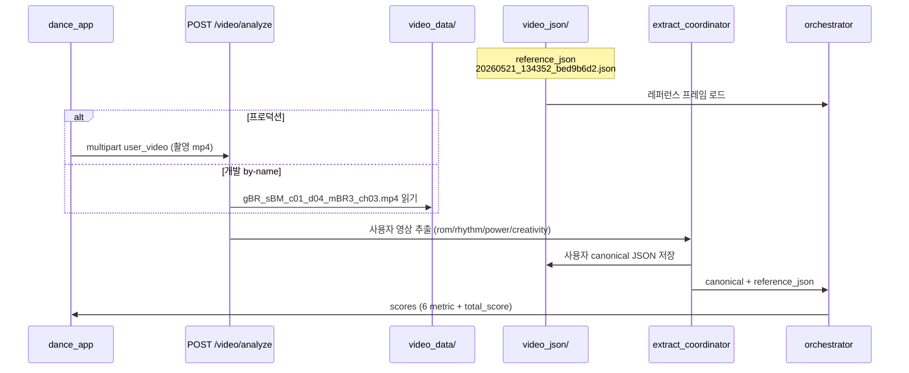

# 개발용 고정 영상·레퍼런스 데이터셋

> 작성일: 2026-05-21  
> 용도: `dance_app` ↔ `POST /video/analyze` 연동 테스트, 재현 가능한 E2E  
> 관련: [API_REFERENCE.md](./API_REFERENCE.md), [ORCHESTRATOR.md](./ORCHESTRATOR.md)

---

## 1. 요약

**dance_app:** `video_data/card1` … `card5` — 챌린지 id 1~5와 1:1 (`home_repository.dart`).

| 카드 | reference_json | 서버 MP4 (video_data/) |
|------|----------------|------------------------|
| 1 팝핑 | `20260521_134352_bed9b6d2.json` | `gBR_sBM_c01_d06_mBR3_ch03.mp4` |
| 2 브레이킹 | `20260521_154323_979d22e6.json` | `gBR_sBM_c01_d04_mBR3_ch03.mp4` |
| 3 록킹 | `20260521_154842_eee5efdc.json` | `gHO_sBM_c01_d19_mHO3_ch03.mp4` |
| 4 왜킹 | `20260521_155027_4acf1e1d.json` | `gJB_sBM_c01_d07_mJB3_ch03.mp4` |
| 5 하우스 | `20260521_155225_a8cc4d5b.json` | `gMH_sBM_c01_d24_mMH3_ch03.mp4` |

분석 시 선택 카드의 **`reference_json`** · Report 전문가 **`video_data/cardN/*.mp4`** (asset) 사용.

앱 기본값: `dance_app/lib/core/config/api_config.dart`  
백엔드 개발 API: `POST /video/analyze/by-name`

---

## 2. 파일 위치 (절대 경로 기준)

```
backend1/metrics/rom/domain/domain1/video_data/
├── gBR_sBM_c01_d04_mBR3_ch03.mp4          ← 사용자(개발) 원본 영상
├── 20260521_134352_bed9b6d2_annotated.mp4 ← 레퍼런스 추출 시 생성된 오버레이(선택)
└── video_json/
    └── 20260521_134352_bed9b6d2.json      ← 전문가(레퍼런스) 추출 JSON
```

---

## 3. 전문가(레퍼런스) 데이터 — `20260521_134352_bed9b6d2.json`

### 3.1 무엇인가

- **이미 추출·저장된** 전문가 포즈 시퀀스 (`schema: full_v1`).
- 채점 시 **영상을 다시 디코딩하지 않음** — 오케스트레이터가 이 JSON만 로드.
- `POST /video/analyze` / `/video/analyze/by-name` 의 **`reference_json`** 필드 값.

### 3.2 메타 (서버 기준, 2026-05-21 측정)

| 항목 | 값 |
|------|-----|
| schema | `full_v1` |
| source_fps | ~59.94 |
| source_total_frames | **523** |
| sample_stride | 4 |
| effective_sample_fps | ~15 |
| 추출 프레임 수 (`frames`) | **131** |
| 활성 구간 `time_sec` | 0.0 → ~8.68초 |

### 3.3 원본 영상 추정

동일 디렉터리의 **`gBR_sBM_c01_d04_mBR3_ch03.mp4`** 와 메타가 일치합니다.

| 비교 항목 | 레퍼런스 JSON | `gBR_sBM_c01_d04_mBR3_ch03.mp4` |
|-----------|---------------|----------------------------------|
| source_fps | 59.94 | 59.94 |
| source_total_frames | 523 | 523 |
| 대략 길이 | ~8.7초 | ~8.73초 |

→ 레퍼런스 JSON은 **이 MP4(또는 동일 소스)를 `POST /video/extract` (mode=full) 로 추출한 결과**로 보는 것이 타당합니다.  
파일명 `20260521_134352_*` 는 추출 시각·UUID 접두사이며, AIST++/그루브 데이터셋 스타일 파일명 `gBR_sBM_...` 과는 별도입니다.

### 3.4 생성 방법 (재현)

```bash
cd backend1
# gBR MP4를 video_data/에 둔 뒤
curl -X POST "http://127.0.0.1:8000/video/extract" \
  -F "file=@metrics/rom/domain/domain1/video_data/gBR_sBM_c01_d04_mBR3_ch03.mp4" \
  -F "extraction_mode=full" \
  -F "target_fps=15"
# 응답 json_filename → reference_json 으로 사용
```

현재 통합 테스트는 **이미 있는** `20260521_134352_bed9b6d2.json` 을 그대로 씁니다.

---

## 4. 사용자(user) 데이터 — `gBR_sBM_c01_d04_mBR3_ch03.mp4`

### 4.1 무엇인가

- **개발·E2E용 사용자 영상** 고정값.
- 실제 서비스에서는 Studio **카메라 촬영본**이 `user_video` multipart 로 올라갑니다.
- 개발 시에는 서버 `video_data/` 에 있는 이 파일을 쓰면 촬영 없이 동일 조건으로 반복 테스트 가능.

### 4.2 메타

| 항목 | 값 |
|------|-----|
| 크기 | ~2.2MB (로컬 기준) |
| fps | ~59.94 |
| 총 프레임 | 523 |
| 길이 | ~8.73초 |

### 4.3 앱(홈)과의 관계

`dance_app` 홈 목업 카드 **「하우스 풋워크」** (`id: 5`) 의 `videoUrl` 이 동일 파일명을 가리킵니다.

```text
video_data/gBR_sBM_c01_d04_mBR3_ch03.mp4
```

Studio **레퍼런스 미리보기**는 홈에서 고른 챌린지 asset 영상이고,  
**채점 API**의 `reference_json` 은 저장 파일명이며, **dance_app** 은 `video_data/cardN/<referenceJson>` 을 **`reference_json_file`** multipart 로 업로드합니다. (서버 `video_json/` 사전 복사 불필요)

---

## 5. `POST /video/analyze` 에서 무엇이 오가는지



| 단계 | 입력 | 출력 |
|------|------|------|
| Phase A | 사용자 MP4 | `video_json/{새베이스}.json` (canonical) + sidecar `*_rhythm.json` 등 |
| Phase B | canonical + **reference_json** | `alignment`, `scores`, `meta` |

---

## 6. 호출 방법

### 6.1 curl — 서버 고정 MP4 (개발)

```bash
curl -X POST "http://127.0.0.1:8000/video/analyze/by-name" \
  -F "user_video_filename=gBR_sBM_c01_d04_mBR3_ch03.mp4" \
  -F "reference_json=20260521_134352_bed9b6d2.json" \
  -F "auto_detect_start=true" \
  -F "extraction_mode=full"
```

### 6.2 curl — multipart (사용자 파일 직접 지정)

```bash
curl -X POST "http://127.0.0.1:8000/video/analyze" \
  -F "user_video=@metrics/rom/domain/domain1/video_data/gBR_sBM_c01_d04_mBR3_ch03.mp4" \
  -F "reference_json=20260521_134352_bed9b6d2.json" \
  -F "auto_detect_start=true" \
  -F "extraction_mode=full"
```

### 6.3 dance_app

| 설정 | 위치 | 값 |
|------|------|-----|
| `defaultReferenceJson` | `api_config.dart` | `20260521_134352_bed9b6d2.json` |
| `devUserVideoFilename` | `api_config.dart` | `gBR_sBM_c01_d04_mBR3_ch03.mp4` |
| `useDevServerUserVideo` | `api_config.dart` | Debug 빌드 기본 `true` → `POST /video/analyze/by-name` |

실기기·릴리스: `flutter run --dart-define=USE_DEV_SERVER_VIDEO=false` 후 촬영본 업로드.

---

## 7. 길이·정렬 참고

- 레퍼런스 JSON 과 사용자 MP4 는 **동일 소스(523프레임)** 이므로 프레임 수 비율 검증(10배 규칙)에 유리합니다.
- 개발 시 **같은 안무를 자기 자신과 비교**하는 형태 → 점수는 “실력”보다 **파이프라인 검증**용에 가깝습니다.
- 서로 다른 안무로 바꿀 때는 **레퍼런스 JSON을 해당 전문가 영상으로 다시 extract** 해야 합니다.

---

## 8. 변경 시 체크리스트

1. 사용자 MP4 교체 → `api_config.devUserVideoFilename` + `video_data/` 파일
2. 전문가 JSON 교체 → `api_config.defaultReferenceJson` + `video_json/` 파일
3. `GET /health` → `POST /video/analyze/by-name` → Report 레이더 6축 확인
4. OpenAPI `GET /docs` 에서 `analyze_by_name` 스키마 확인
