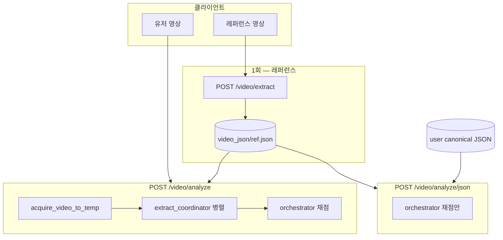

# Analyze 오케스트레이터 — 설계·대화 정리·구현 현황

> 작성일: 2026-05-21 (최종 갱신)  
> 기준: [ARCHITECTURE.md](./ARCHITECTURE.md), [INTEGRATION_STRATEGY.md](./INTEGRATION_STRATEGY.md)  
> API 필드: [API_REFERENCE.md](./API_REFERENCE.md)  
> 구현: `backend1/services/orchestrator.py`, `backend1/services/extract_coordinator.py`, `backend1/routers/video.py`

---

## 1. 합의한 아키텍처 (대화 요약)

### 1.1 레이어 분리

FOM 통합 API(`backend1`)는 **추출**과 **채점**을 명시적으로 나눈다.

| 레이어 | 파일 | 역할 | 하지 않는 것 |
|--------|------|------|----------------|
| **HTTP** | `routers/video.py` | multipart/JSON 요청, 응답 조립 | metric 비즈니스 로직 직접 구현 |
| **추출 조율** | `services/extract_coordinator.py` | 사용자 영상 → metric별 `extract_*` **병렬** 실행, ROM canonical JSON 저장 | 프레임 정렬, `score_*` 호출 |
| **채점 오케스트레이터** | `services/orchestrator.py` | 저장 JSON 로드 → 정렬 → `score_*` **병렬** → `total_score`/`grade` | 영상 디코딩, MediaPipe, metric 추출 |
| **도메인** | `metrics/*`, `metrics/rom/domain/domain1/` | 각 metric의 추출·채점 알고리즘 | 다른 metric import (ARCHITECTURE §1) |

**핵심 문장 (ARCHITECTURE §1.1):**

- 오케스트레이터는 **「한 번 추출한 뒤 각 도메인이 필터만 한다」** 모델이 **아니다.**
- analyze 요청 안에서 오케스트레이터는 **추출을 하지 않는다** — 다만 **`POST /video/analyze`(영상 업로드)** 는 라우터가 **먼저** `extract_coordinator`를 호출한 뒤, **이어서** 오케스트레이터를 호출하는 **2단계** 흐름이다.

### 1.2 creativity / accuracy 진입점

| metric | HTTP 전용 라우터 | CLI / 기타 |
|--------|------------------|------------|
| **creativity** | 없음 | `python -m metrics.creativity` (`cli.py`) |
| **accuracy** (FOM 채점) | 없음 | ROM `accuracy_scorer.py` — 오케스트레이터가 호출 |
| **accuracy** (COCO 시각화) | 없음 | `metrics/accuracy/` — **별도** 스크립트, FOM 채점과 무관 |

FOM **accuracy 채점** 구현 위치: `metrics/rom/domain/domain1/hub/services/scoring/accuracy_scorer.py` (`score_accuracy`).

### 1.3 정렬(alignment) 소유

- **프레임 정렬**(`aligned_pairs`)은 오케스트레이터가 ROM `alignment.py`(`align_by_time`, `align_by_dtw`)로 수행한다.
- metric의 `score_*` 중 **accuracy, creativity, isolation** 은 `aligned_pairs`만 입력으로 받는다 (ARCHITECTURE §4).
- **rom** 은 정렬 쌍이 아니라 offset 이후 **활성 프레임 리스트**로 `score_rom` 호출.
- **power** / **rhythm** 은 **전체 추출 JSON**(`user_extraction`, 필요 시 `ref_extraction`)을 받는다.

---

## 2. 배경 문제와 Phase 1 (라우터)

### 2.1 prefix 충돌 (✅ 해결됨)

이전: rhythm `prefix="/video"` 가 통합 `/video/analyze` 를 가림.

**현재 (`main.py`):**

- `metrics/rhythm/routers/video.py` → `prefix="/rhythm"`
- 등록: `video_router` → `rhythm` → `isolation` → `power`
- `GET /health` — route 메타

### 2.2 레거시 ROM 단일 경로

이전 `POST /video/analyze`는 `domain.domain1.hub.services.analyze_service.run_analyze` 한 경로(ROM + 선택 accuracy, `compute_comparison`)만 사용했다.

**현재:** 위 서비스 대신 **extract_coordinator → orchestrator** 로 교체했다.

---

## 3. 구현 구조

### 3.1 전체 흐름 (mermaid)



### 3.2 `POST /video/analyze` (영상 + 레퍼런스 JSON)

1. `acquire_video_to_temp` — `user_video` 또는 `video_url`
2. **`run_user_extractions_parallel`** (Phase A)
   - 기본 파이프라인: `rom`, `rhythm`, `power`, `creativity` (병렬, `ThreadPoolExecutor` max 4)
   - ROM 실패 시 전체 실패 (canonical 없음)
   - 채점 metric에 accuracy/creativity/isolation/power/rhythm 포함 시 ROM 추출 모드를 **`full`** 로 자동 승격
3. **`run_analyze_from_json`** (Phase B)
   - `canonical_json` + `reference_json` 파일명
   - 정렬 + 6 `score_*` 병렬

**응답 필드:**

| 필드 | 출처 |
|------|------|
| `user` | ROM 추출 공개 메타 |
| `reference` | `build_reference_meta` |
| `extractions` | 파이프라인별 ok/error (rom, rhythm, power, creativity) |
| `alignment` | 오케스트레이터 |
| `scores` | 오케스트레이터 (`total_score`, `grade` 포함) |
| `meta` | 채점 메타 + `user_json`, `pipelines_run`, `rom_extraction_mode` |

### 3.3 `POST /video/analyze/json` (JSON만)

- 영상·추출 없음 → **`run_analyze_from_json`만** 호출
- Body: `AnalyzeJsonRequest` (`user_json`, `reference_json`, `metrics`, `fail_fast`, alignment 옵션 등)

### 3.4 `POST /video/extract`

- ROM domain1 `run_extraction_and_save`만 (레퍼런스 1회 생성용)
- 오케스트레이터와 무관

---

## 4. 오케스트레이터 상세 (`services/orchestrator.py`)

### 4.1 공개 API

| 함수 | 용도 |
|------|------|
| `resolve_metrics_list` | `metrics` 배열 또는 레거시 `enable_accuracy` / `enable_rom` → 실행 목록 |
| `build_aligned_pairs` | user/ref 프레임 → `aligned_pairs` + alignment 메타 |
| `run_all_scores` | 선택 metric에 대해 `score_*` 병렬 (`asyncio` + executor) |
| `compute_total_score` | 성공 metric 점수 평균 → `total_score`, `grade` |
| `run_analyze_from_json` | **진입점** — JSON 파일명 2개 → 전체 응답 dict |

### 4.2 metric별 채점 호출

| metric | 함수 | 입력 |
|--------|------|------|
| accuracy | `score_accuracy` (ROM) | `aligned_pairs`, `detail_level`, `scoring_mode` |
| creativity | `score_creativity` | `aligned_pairs` |
| isolation | `score_isolation` | `aligned_pairs` |
| rom | `score_rom` | offset 이후 `user_frames`, `ref_frames` |
| power | `score_power` | `user_extraction` (전체 JSON) |
| rhythm | `score_rhythm_vs_reference` 또는 `score_rhythm_from_extraction` | user/ref extraction |

### 4.3 병렬·오류 처리

- `ThreadPoolExecutor(max_workers=6)` + `asyncio.create_task` / `gather`
- **`fail_fast=False` (기본, 라우터·`AnalyzeJsonRequest` 동일):** metric 실패 시 `scores.<metric>.breakdown.error`, 나머지 계속
- **`fail_fast=True`:** 첫 예외 시 HTTP 500
- **`total_score`:** `breakdown.error` 없는 metric `score` 의 **단순 평균** (`METRIC_WEIGHTS` 는 코드에만 존재, 미적용)

### 4.4 검증

- user/ref 프레임 수 비율이 10배 초과 또는 1/10 미만이면 `ValueError`
- accuracy/creativity/isolation 요청 시 `aligned_pairs` 비어 있으면 실패

### 4.5 `metrics` 파라미터 해석

| `metrics` | 결과 |
|-----------|------|
| `["accuracy","rom",...]` 등 지정 | 지정 목록만 |
| `null` / 생략 (기본) | **6개 전체** (`accuracy`, `creativity`, `isolation`, `power`, `rhythm`, `rom`) |
| `rom` (multipart Form) | `rom` 만 |

`enable_accuracy` / `enable_rom` 은 `metrics` 미지정 시 **사용하지 않음**. ROM만 채점: `metrics=rom`.

multipart `analyze`의 Form `metrics`는 쉼표 구분 문자열 (`accuracy,creativity,...`).

---

## 5. 추출 조율 상세 (`services/extract_coordinator.py`)

### 5.1 역할

- **사용자 영상 1개**에 대해 metric 추출을 병렬 실행
- **canonical** 채점 입력 = ROM이 저장한 `video_json/<base>.json` 파일명

### 5.2 sidecar JSON

| 파이프라인 | 저장 파일 예 | 채점에 사용 |
|------------|--------------|-------------|
| rom | `{base}.json` | **예** (canonical) |
| rhythm | `{base}_rhythm.json` | 아직 아니오 (오케스트레이터는 ROM JSON 로드) |
| power | `{base}_power.json` | 아직 아니오 |
| creativity | `{base}_creativity.json` | 아직 아니오 |

향후: metric별 artifact 경로를 오케스트레이터에 넘기도록 확장 (ARCHITECTURE §2.1 주석).

### 5.3 `pipelines` (코드만, HTTP 미노출)

`run_user_extractions_parallel(pipelines=[...])` 로 파이프라인 subset 가능. 라우터는 아직 Form `pipelines` 를 넘기지 않음 — 항상 `DEFAULT_EXTRACT_PIPELINES`.

### 5.4 isolation (통합 analyze)

- **기본 추출** `DEFAULT_EXTRACT_PIPELINES`: rom, rhythm, power, creativity — **YOLO isolation 추출 없음** (속도).
- **채점** (6 metric에 isolation 포함): ROM `aligned_pairs` → `score_isolation` (`breakdown.scoring_source=rom_aligned_pairs`).
- **YOLO 추출**이 필요할 때만 `run_user_extractions_parallel(pipelines=[..., "isolation"])` 명시 → `{base}_isolation.json` → `score_isolation_for_fom`.

---

## 6. API·라우트 현황

전체 필드·응답: [API_REFERENCE.md](./API_REFERENCE.md).

| 메서드 | URL | 추출 | 채점 |
|--------|-----|------|------|
| `POST` | `/video/extract` | ROM | — |
| `POST` | `/video/analyze` | extract_coordinator | orchestrator |
| `POST` | `/video/analyze/json` | — | orchestrator |
| `POST` | `/video/compare` | — | ROM `compute_comparison` (6-metric과 별도) |
| `GET` | `/video/json/{filename}`, `/video/data/{filename}` | — | — |
| `POST` | `/rhythm/*` | rhythm 전용 | rhythm 전용 |
| `POST` | `/isolation/*` | isolation 전용 | isolation 전용 |
| `POST` | `/power/*` | power 전용 | power 전용 |
| `GET` | `/health` | — | — |

**creativity / accuracy HTTP 없음** — 통합 `score_creativity` / ROM `score_accuracy` 만.

---

## 7. 클라이언트 권장 흐름

1. **레퍼런스:** `POST /video/extract` → `reference_json` 파일명 확보 (`video_json/`).
2. **유저 (한 번에):** `POST /video/analyze` — 영상 + `reference_json` + (선택) `metrics=accuracy,creativity,isolation,power,rhythm,rom`.
3. **재채점만:** 동일 user JSON이 이미 있으면 `POST /video/analyze/json` — 파라미터만 바꿔 반복.

**ROM만 빠르게:** `metrics=rom` (또는 JSON body `metrics: ["rom"]`). 추출은 여전히 rhythm/power/creativity sidecar까지 돌 수 있음 — 추후 `pipelines` 옵션으로 최적화 가능).

---

## 8. 제한·알려진 이슈

| 항목 | 설명 |
|------|------|
| ROM JSON 단일 입력 | power/rhythm/creativity 채점이 ROM `full_v1` 스키마에 의존. `rom_v1`만 있으면 일부 metric `breakdown.error` 가능 |
| sidecar 미연동 | rhythm/power/creativity 추출 JSON은 저장되나 채점 입력으로 아직 미사용 |
| creativity 정렬 | 통합 경로는 ROM `alignment` (time/dtw). creativity CLI 전용 `index` 정렬은 오케스트레이터에 없음 |
| isolation 추출 | 통합 analyze 기본 스킵. `pipelines`에 isolation 명시 시만 YOLO |
| 의존성 | rhythm 라우터 import 시 `librosa` 필요 — `pip install -r requirements.txt` |
| `metrics/rom/main.py` | 사용하지 않음. ROM path는 `backend1/main.py`에서만 `sys.path` 설정 |

---

## 9. 파일 맵

```
backend1/
├── main.py                          # ROM sys.path, 라우터 등록
├── routers/video.py                 # /video/* HTTP
├── services/
│   ├── orchestrator.py              # 채점만
│   └── extract_coordinator.py       # 추출 병렬
├── metrics/
│   ├── creativity/creativity.py     # score_creativity
│   ├── isolation/score.py           # score_isolation
│   ├── power/__init__.py            # score_power
│   ├── rhythm/.../rhythm_scorer.py  # score_rhythm_*
│   └── rom/domain/domain1/hub/services/scoring/
│       ├── accuracy_scorer.py       # score_accuracy
│       ├── alignment.py             # align_by_* (오케스트레이터 사용)
│       └── rom_scorer.py            # score_rom
└── metrics/docs/
    ├── ARCHITECTURE.md              # 규범 (6인 1서비스, 추출/채점 경계)
    ├── INTEGRATION_STRATEGY.md      # Phase 완료 현황·백로그
    ├── API_REFERENCE.md             # HTTP 필드·응답
    └── ORCHESTRATOR.md              # 본 문서
```

---

## 10. 실행·검증

```bash
cd backend1
pip install -r requirements.txt
uvicorn main:app --host 0.0.0.0 --port 8000
```

- `GET /health` — 진입점·route 메타
- `GET /docs` — `POST /video/analyze`, `/video/analyze/json` 스키마 확인

---

## 11. 향후 작업 (백로그)

1. 오케스트레이터가 metric별 sidecar JSON 경로를 입력으로 받도록 확장
2. `extract_coordinator`에 `pipelines` 쿼리 — ROM-only 시 sidecar 생략
3. isolation YOLO 추출 병렬 추가
4. creativity 전용 정렬(`index`)·전처리 JSON을 채점 경로에 반영 여부 결정
5. Flutter 등 클라이언트 `api_config` — 단일 `/video/analyze` 응답 스키마 정렬

---

## 12. 변경 이력 (구현 타임라인)

| 단계 | 내용 |
|------|------|
| Phase 1 | rhythm `prefix=/rhythm`, `main.py` 라우터 정리 |
| Phase 2 | `orchestrator.py` 신규, `/video/analyze/json` 연결 |
| Phase 3 | `extract_coordinator.py` 신규, `/video/analyze` 2단계(추출→채점) 연결 |
| 문서 | 본 `ORCHESTRATOR.md` 작성 |

레거시 `run_analyze` / `compute_comparison` 직접 호출은 통합 `/video/analyze`에서 제거됨. ROM domain 내부 코드는 `extract`·`score_*` 구현으로 계속 사용한다.
