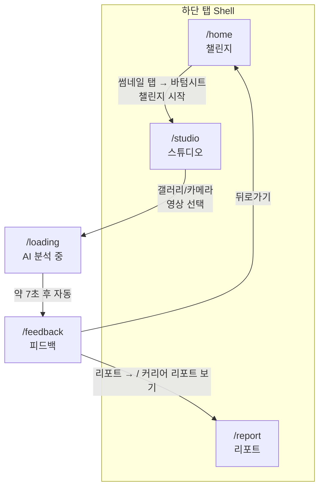

# Dance AI — 앱 화면 구성 가이드

> **문서 목적:** `CLAUDE.md` MVP 명세와 현재 Flutter 구현(`dance_app`)을 대조하여, 탭·화면·네비게이션·데이터 흐름을 한눈에 파악할 수 있도록 정리한 문서입니다.

---

## 1. 프로젝트 개요

| 항목 | 내용 |
|------|------|
| **서비스명** | AI 기반 스트릿 댄스 레벨 판정 & 커리어 가이드 플랫폼 (MVP) |
| **타깃** | 10대 — 또래 평가에 민감하고, 진로 방향이 필요한 사용자 |
| **핵심 가치** | 사람 개입 없이, 안전한 연습 환경에서 객관적 AI 분석 + 맞춤 커리어 로드맵 제공 |
| **UI 방향** | TikTok/Reels 스타일 — 빠르고 직관적, **다크 모드** + **네온 악센트** (그린·퍼플·블루) |
| **인증** | 없음 (로그인/회원가입 생략) |

---

## 2. 기술 스택 & 프로젝트 구조

### 2.1 기술 스택

| 영역 | 사용 기술 |
|------|-----------|
| 프레임워크 | Flutter (SDK ^3.11) |
| 상태 관리 | `flutter_riverpod` |
| 라우팅 | `go_router` |
| 미디어 | `image_picker`, `video_player` (의존성 포함) |
| 차트 | `fl_chart` (레이더 차트) |
| 애니메이션 | `lottie` (의존성 포함, 로딩 화면은 현재 CustomPaint 대체) |
| 데이터 | Mock Repository + `Future.delayed` 시뮬레이션 |

### 2.2 폴더 구조 (feature-first)

```
dance_app/lib/
├── main.dart                          # 앱 진입점, ProviderScope, MaterialApp.router
├── core/
│   ├── router/app_router.dart         # go_router + BottomNavigationBar Shell
│   └── theme/app_theme.dart           # 다크 테마, AppColors
├── features/
│   ├── home/                          # 탭 1 — 챌린지 목록
│   │   ├── data/home_repository.dart
│   │   └── presentation/home_screen.dart
│   ├── studio/                        # 탭 2 — 촬영/업로드
│   │   └── presentation/studio_screen.dart
│   ├── loading/                       # 전체 화면 — AI 분석 대기
│   │   └── presentation/loading_screen.dart
│   ├── feedback/                      # 전체 화면 — 동작 피드백
│   │   └── presentation/feedback_screen.dart
│   └── report/                        # 탭 3 — 재능·커리어 리포트
│       ├── data/report_repository.dart
│       └── presentation/report_screen.dart
└── shared/widgets/neon_badge.dart     # 장르·난이도·태그 뱃지
```

---

## 3. 네비게이션 구조

앱은 **하단 탭 3개**와 **탭 밖 전체 화면 2개**로 구성됩니다. 총 **5개 화면**이며, `CLAUDE.md` 명세와 동일합니다.

### 3.1 라우트 맵

| 경로 | 화면 | 하단 탭 표시 | 비고 |
|------|------|:------------:|------|
| `/home` | Home (챌린지) | ✅ 탭 1 | 초기 진입 (`initialLocation`) |
| `/studio` | Studio (스튜디오) | ✅ 탭 2 | |
| `/report` | Report (리포트) | ✅ 탭 3 | |
| `/loading` | Loading (분석 중) | ❌ | Shell 밖 — 전체 화면 |
| `/feedback` | Feedback (피드백) | ❌ | Shell 밖 — 전체 화면 |

### 3.2 하단 네비게이션 바

`ShellRoute` + `_ScaffoldWithNav`로 탭 3개 화면에만 `BottomNavigationBar`가 노출됩니다.

| 인덱스 | 라벨 (UI) | 아이콘 | 역할 (명세) |
|:------:|-----------|--------|-------------|
| 0 | Challenge | `home_rounded` | Home — 레퍼런스 탐색 |
| 1 | Studio | `videocam_rounded` | Studio — 촬영/업로드 |
| 2 | Report | `bar_chart_rounded` | Report — AI 결과·커리어 |

> **참고:** 탭 라벨은 현재 영어(`Challenge`, `Studio`, `Report`)이며, 각 화면 본문은 한국어로 표기되어 있습니다.

### 3.3 화면 전환 흐름 (사용자 여정)



**주요 전환 규칙**

- Home → Studio: 바텀시트 **「챌린지 시작」** → `context.go('/studio')`
- Studio → Loading: `image_picker`로 영상 선택 성공 시 → `context.go('/loading', extra: file.path)`
- Loading → Feedback: **7초** 후 자동 → `context.go('/feedback', extra: videoPath)`
- Feedback → Report: AppBar **「리포트 →」** 또는 하단 CTA **「커리어 리포트 보기 →」**
- Feedback → Home: AppBar 뒤로가기 → `context.go('/home')`

---

## 4. 디자인 시스템

| 토큰 | 색상/용도 |
|------|-----------|
| `background` | `#0A0A0A` — 메인 배경 |
| `surface` | `#141414` — 바텀시트, 서피스 |
| `card` | `#1E1E1E` — 카드 |
| `neonGreen` | `#39FF14` — 주 액센트, 선택 탭 |
| `neonPurple` | `#BF5AF2` — 보조 액센트 |
| `neonBlue` | `#00D4FF` — 점수·태그 |
| `error` | `#FF3B30` — 미스 타이밍·교정 포인트 |

- **방향:** 세로 고정 (`portraitUp` only)
- **공통 위젯:** `NeonBadge` — 장르, 난이도, 교정 태그 등

---

## 5. 화면별 상세

### 5.1 Home — 챌린지 (탭 1)

**파일:** `lib/features/home/presentation/home_screen.dart`  
**데이터:** `HomeRepository` → `homeVideosProvider` (Riverpod `FutureProvider`)

#### 역할 (명세 대응)

레퍼런스 댄스 영상 목록을 탐색하고, 챌린지를 시작하기 전에 미리보기합니다.

#### UI 구성

| 영역 | 구현 내용 |
|------|-----------|
| 헤더 | 그라데이션 타이틀 **「댄스 / 챌린지」**, 부제 **「레퍼런스를 선택하고 도전해보세요」** |
| 목록 | 세로 스크롤 `SliverList` — 카드형 영상 아이템 |
| 썸네일 | 장르별 이모지 + 그라데이션 플레이스홀더, 재생 시간, 장르 `NeonBadge` |
| 메타 | 제목, 아티스트, 난이도 뱃지 (`초급` / `중급` / `고급`) |

#### 인터랙션

1. 카드 탭 → **모달 바텀시트** (`_ChallengeBottomSheet`)
2. 바텀시트: 제목·아티스트, 미리보기 영역(플레이 아이콘), **「챌린지 시작」** 버튼
3. 버튼 탭 → 바텀시트 닫힘 + **Studio 탭**으로 이동

#### Mock 데이터 예시 (`home_repository.dart`)

| 제목 | 장르 | 난이도 |
|------|------|--------|
| 팝핑 기초 | 팝핑 | 초급 |
| 브레이킹 입문 | 브레이킹 | 중급 |
| 롹킹 그루브 | 롹킹 | 초급 |
| 왜킹 로열 | 왜킹 | 고급 |
| 하우스 풋워크 | 하우스 | 중급 |

- API 지연 시뮬레이션: **800ms**

---

### 5.2 Studio — 스튜디오 (탭 2)

**파일:** `lib/features/studio/presentation/studio_screen.dart`

#### 역할 (명세 대응)

상단 레퍼런스, 하단 사용자 영상 업로드/촬영 — **스플릿 뷰** 구조.

#### UI 구성

| 영역 | 비율 | 내용 |
|------|------|------|
| **레퍼런스** (`_ReferencePanel`) | flex 3 | 라벨 **「레퍼런스」**, 루프 영상 플레이스홀더, **「팝핑 기초 — 반복 재생」** |
| 구분선 | — | 네온 그라데이션 1px |
| **내 영상** (`_UploadPanel`) | flex 4 | **「갤러리에서 업로드」** / **「지금 촬영하기」** (`image_picker`) |

#### 인터랙션

- **갤러리:** `ImageSource.gallery`, 최대 2분
- **카메라:** `ImageSource.camera`
- 선택 성공 시 즉시 `/loading`으로 이동 (`extra`: 로컬 파일 경로)
- 로딩 중: `CircularProgressIndicator`

> **MVP 한계:** 실제 `video_player` 루프 재생·카메라 라이브 프리뷰는 미연동(플레이스홀더 UI).

---

### 5.3 Loading — AI 분석 중 (전체 화면)

**파일:** `lib/features/loading/presentation/loading_screen.dart`

#### 역할 (명세 대응)

AI Vision·LLM 처리 대기 중 10대 사용자 이탈 방지 — **몰입형 로딩 UX**.

#### UI 구성

| 요소 | 구현 |
|------|------|
| 중앙 애니메이션 | `CustomPaint` 스켈레톤 댄스 애니메이션 (펄스·회전 링) |
| 동적 문구 | 2초마다 순환 (6개 메시지, 한국어) |
| 진행률 | **「AI 분석 중」** + 선형 프로그레스 바 (최대 ~95%까지 증가) |

**순환 메시지 예**

- 관절 움직임 분석 중...
- 리듬 정확도 계산 중...
- 비트 타이밍 감지 중...
- 레퍼런스와 비교 중...
- 커리어 로드맵 생성 중...
- AI 분석 마무리 중...

#### 자동 전환

- **7초** 후 `/feedback`으로 이동 (`videoPath` 전달)

> **명세 vs 구현:** `CLAUDE.md`는 Lottie 스켈레톤을 요구하나, 현재는 CustomPaint 기반 플레이스홀더입니다. `lottie` 패키지는 `pubspec.yaml`에 포함되어 있습니다.

---

### 5.4 Feedback — AI 피드백 (전체 화면)

**파일:** `lib/features/feedback/presentation/feedback_screen.dart`

#### 역할 (명세 대응)

동작 교정 중심 — 영상 + 스켈레톤 오버레이, 점수, 타임라인, 교정 포인트.

#### UI 구성

| 영역 | 내용 |
|------|------|
| **AppBar** | 뒤로 → Home, 타이틀 **「AI 피드백」**, **「리포트 →」** |
| **영상 영역** | 9:16 비율, 그라데이션 플레이스홀더 + `CustomPaint` 스켈레톤 오버레이 |
| **타임라인** | 가로 스크럽 바, 빨간 점 = 미스 타이밍 (4곳), **「미스 타이밍」** 범례 |
| **점수** | 원형 프로그레스 3개 — 리듬 정확도 85%, 포즈 일치도 90%, 종합 점수 87% |
| **교정 포인트** | 타임스탬프 + 설명 + 태그 (`팝 타이밍`, `포즈 매치` 등) |
| **CTA** | **「커리어 리포트 보기 →」** → Report |

#### 전달 데이터

- `videoPath` (Loading에서 `extra`로 수신) — 현재 UI에는 미표시, 추후 `video_player` 연동용

> **명세 vs 구현:** 실제 영상 재생·`video_player` + 키포인트 오버레이는 Mock(`CustomPaint`) 상태입니다.

---

### 5.5 Report — 재능·커리어 리포트 (탭 3)

**파일:** `lib/features/report/presentation/report_screen.dart`  
**데이터:** `ReportRepository` → `reportProvider`

#### 역할 (명세 대응)

스크롤 대시보드 — 재능 레이더, AI 커리어 가이드, 추천 진로.

#### UI 구성

| 섹션 | 내용 |
|------|------|
| 헤더 | **「재능 / 리포트」** 그라데이션, 장르 뱃지, **「점수 87」** |
| **재능 레이더** | `fl_chart` `RadarChart` — 가동범위, 파워, 리듬, 아이솔, 창의성 + 범례 |
| **AI 커리어 가이드** | 카드 UI, **「LLM 분석 기반」**, 격려형 한국어 더미 메시지 |
| **추천 진로** | 2열 그리드 — 백업 댄서, 안무가, 댄스 강사, 뮤직비디오 아티스트 |

#### Mock 데이터 (`report_repository.dart`)

- 장르: 팝핑, 종합 점수: 87
- 레이더: ROM 78%, Power 92%, Rhythm 88%, Isolation 95%, Creativity 72%
- API 지연 시뮬레이션: **600ms**

#### 접근 경로

1. 하단 탭 **Report**에서 직접 진입
2. Feedback 화면에서 **리포트** / **커리어 리포트 보기** 버튼

---

## 6. 데이터 계층 (Mock)

| Repository | Provider | 지연 | 반환 |
|------------|----------|------|------|
| `HomeRepository` | `homeVideosProvider` | 800ms | `List<DanceVideo>` 5건 |
| `ReportRepository` | `reportProvider` | 600ms | `CareerReport` 1건 |

화면 간 **영상 경로**는 `go_router`의 `state.extra`로 Loading → Feedback에 전달됩니다.  
`shared_preferences`는 의존성에 포함되어 있으나, 현재 MVP UI에서는 미사용입니다.

---

## 7. 명세 대비 구현 현황 요약

| 항목 | CLAUDE.md 명세 | 현재 구현 |
|------|----------------|-----------|
| 하단 탭 3개 | ✅ | ✅ ShellRoute |
| 화면 5개 | ✅ | ✅ |
| Home 바텀시트 + 챌린지 시작 | ✅ | ✅ |
| Studio 갤러리/촬영 | ✅ | ✅ `image_picker` |
| Loading 동적 문구 2초 | ✅ | ✅ |
| Loading Lottie 스켈레톤 | Lottie | CustomPaint (대체) |
| Feedback 스켈레톤 오버레이 | video_player + CustomPaint | CustomPaint only (영상 Mock) |
| Report 레이더 차트 | fl_chart | ✅ |
| Report LLM 카드 | ✅ | ✅ 한국어 더미 |
| 인증 | 없음 | ✅ |
| 백엔드 연동 | 추후 | Mock Repository |

---

## 8. 실행 방법

```bash
cd dance_app
flutter pub get
flutter run
```

- 에뮬레이터/실기기에서 하단 탭과 **Studio → 영상 선택 → Loading → Feedback → Report** 흐름을 순서대로 확인할 수 있습니다.

---

## 9. 관련 파일 빠른 참조

| 화면 | 라우트 | 주요 소스 |
|------|--------|-----------|
| Home | `/home` | `features/home/presentation/home_screen.dart` |
| Studio | `/studio` | `features/studio/presentation/studio_screen.dart` |
| Loading | `/loading` | `features/loading/presentation/loading_screen.dart` |
| Feedback | `/feedback` | `features/feedback/presentation/feedback_screen.dart` |
| Report | `/report` | `features/report/presentation/report_screen.dart` |
| 라우터 | — | `core/router/app_router.dart` |
| 테마 | — | `core/theme/app_theme.dart` |

---

*최종 업데이트: 구현 기준 `dance_app` MVP (한국어 UI, Mock 데이터)*
